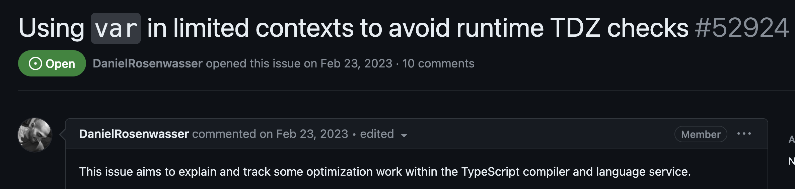
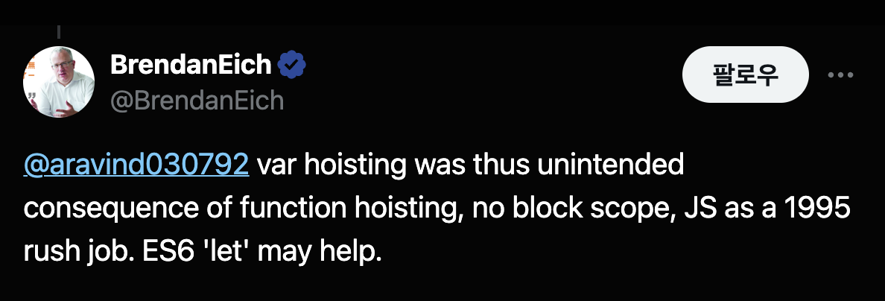

최근 TypeScript Github를 구경하다가 재미있는 이슈을 발견했다. 성능을 위해 **let, const로 작성된 키워드를 var 키워드로 변경한다는 내용이었다.**

<br/>


<br/>
<br/>

- [Using var in limited contexts to avoid runtime TDZ checks #52924](https://github.com/microsoft/TypeScript/issues/52924)

**자바스크립트를 배운 대부분의 개발자라면 var 키워드는 사용하지 않는 것이 좋다고 배웠을 것이다.** var 키워드는 여러 문제점을 가지고 있고 let, const 키워드가 var를 완벽하게 대체할 수 있기 때문이다.

그런데 성능적인 측면에서 var 키워드가 더 빠르다는 것은 처음 들어보는 이야기였다. 좀 더 찾아보니 ECMAScript 위원회인 [TC39](https://github.com/tc39/notes/blob/main/meetings/2023-09/september-27.md#tdz-what-is-it-good-for) 회의에도 논의될 정도로 꽤나 이슈였던 주제였다.

이번 글에서는 var, let, const 성능차이에 대해 알아보고, var 키워드를 사례와 함께 살펴보자.

### var 키워드

10일이라는 짧은 개발기간동안 만들어진 프로그래밍 언어답게 자바스크립트는 이상하고 재미있는(?) 특징이 많다.

특히 변수를 선언하는 var 키워드는 스코프, 중복 선언 가능, 호이스팅 등 여러 문제점을 가지고 있다.

이 중 호이스팅은 다른 프로그래밍 언어 개발자가 보면 정말 이상하게 느낄 수 있다. var 키워드로 선언한 변수는 `선언 전에 사용할 수 있다`. 다음 코드를 보면서 문제점을 알아보자.

```js
{
  console.log(a); // undefined
  var a = 1;
}
```

분명 변수 a를 선언하기 전에 a를 참조하고 있음에도 위 코드는 에러없이 런타임에 정상적으로 동작한다. `호이스팅` 때문인데 자바스크립트를 만든 Brendan Eich에 따르면 이러한 var 호이스팅은 바쁜 작업으로 인한 의도하지 않은 결과라고 한다. (**급하게 작업하느라 그랬다고 한다....)**

<br/>


<br/>
<br/>

이렇게 선언 전에 변수를 사용할 수 있고, 에러를 전혀 발생시키지 않는 var 키워드는 잠재적인 버그를 만들기 쉽다. DX(Developer Experience)를 떨어뜨리는 요소이기도 하다.

대부분의 프로그래밍 언어가 그렇듯이 선언 전에 변수를 사용할 때 에러를 발생시키는 것이 더 좋은 DX를 제공할 수 있다. 이런 이유로 ES6부터 let, const 키워드가 등장하게 되었다.

### let, const

var이 가진 문제를 해결하기 위해 ES6부터 등장한 let, const 키워드는 `TDZ`(Temporal Dead Zone)이라는 개념을 도입하여 호이스팅 문제를 해결한다.

TDZ는 이름 그대로 `임시적인 사각지대`를 의미하는데 변수가 선언되기 전까지 변수를 사용할 수 없는 영역을 말한다.

```js
{
  console.log(a); ---  // TDZ에 있는 a를 참조하려고 하면 ReferenceError 발생한다
  ...                | // TDZ
  ...                | // TDZ
  ...             ---

  let a = 1;
}
```

이때 선언 이전에 참조한 변수 a를 `TDZ에 존재한다`라고 말한다. 만약 `TDZ`에 있는 변수를 참조하려고 하면 JavaScript 엔진은 런타임에 `ReferenceError`를 발생시킨다.

명시적인 에러를 발생시킴으로써 DX(Developer Experience)를 향상시킨다. 이제 선언 이전에 변수를 참조하게 되어 의도하지않게 발생할 수 있는 버그를 방지할 수 있다.

JavaScript 엔진이 코드를 본격적으로 실행하기 전에 수행하는 초기화 단계에서 `TDZ 검사`를 수행한다. 이러한 TDZ 검사는 런타임 비용이 발생한다. "은빛 총알은 없다"는 말이 있듯이, 트레이드 오프가 존재한다.

최신 JavaScript 엔진은 다양한 최적화를 수행하고 이러한 TDZ 검사는 무시할 정도로 작은 비용이 될 수 있다. **하지만 경우에 따라 TDZ 검사 비용이 무시할 수 없을 정도로 커질 수 있다.**

### TDZ 검사

모든 TDZ 검사가 자바스크립트 엔진에 무거운 비용을 발생시키는 것은 아니다. 아래 코드와 같이 JavaScript 엔진이 쉽게 분석할 수 있는 경우에는 TDZ 검사 비용은 무시할 수 있을 정도로 작다.

```js
{
  let x;
  x;
}
```

하지만 다음 예시처럼 복잡한 경우 JavaScript 엔진이 수행하는 TDZ 검사 비용은 커질 수 있다.

```js
{
  foo(); // ReferenceError: x is not defined

  let x;
  function foo() {
    x;
  }
}
```

foo 함수가 에러없이 호출되기 위해서는 foo 함수가 참조하고 있는 **최상위 공유 클로저 변수 x**가 평가되었는 지 확인해야한다. x가 TDZ에 있는지 확인해야하는데 foo 함수 내부에서 선언된 변수가 아니기 때문에 전체 스코프를 검사해야한다. 이러한 경우 TDZ 검사 비용은 커질 수 있다.

이러한 TDZ 검사 비용은 자바스크립트 엔진에 의존적이기 때문에 엔진에 따라 성능차이가 천차만별이다.

실제로 Webkit의 자바스크립트 엔진인 JavaScriptCore는 무려 let, const 키워드가 var 보다 10배 느린 문제점이 존재했었다. (\*현재는 고쳐진 것으로 보인다.)

- [Safari에서 10배 느린 let, const 성능 문제 이슈](https://github.com/evanw/esbuild/issues/478)
- [Webkit 버그 리포트](https://bugs.webkit.org/show_bug.cgi?id=199866)

<br/>


<br/>
<br/>

V8 엔진 역시 var과 let,const에 10%정도의 성능 차이가 존재한다고 한다. ([V8 버그 리포트](https://bugs.chromium.org/p/v8/issues/detail?id=13723))

그렇다면 모든 경우에 의미있는 성능차이가 있는 걸까? 대부분의 소규모 프로젝트에서는 무시할 수 있는 수준인 것 같다.

하지만 대규모 프로젝트에서는 TDZ 검사 비용이 커질 수 있다. 사례를 보면서 좀 더 이해해보자.

### 사례 보기 - TypeScript

TypeScript의 예시를 보면서 좀 더 이해해보자. 다음은 TypeScript Compiler의 소스코드 중 일부이다. (TypeScript의 내부 동작원리는 몰라도 된다. TDZ 검사 비용을 위한 예시로만 보자)

```js
// src/compiler/parser.ts

var scanner = createScanner(ScriptTarget.Latest, /*skipTrivia*/ true);

function initializeState() {
  // .....
  // .....
  // .....
  // .....
  scanner.setText(sourceText);
  scanner.setOnError(scanError);
  scanner.setScriptTarget(languageVersion);
  scanner.setLanguageVariant(languageVariant);
}
```

TypeScript 내부에서 사용하는 scanner라는 변수가 있다. 이 변수는 최상위 레벨 스코프에 선언되어 있다. scanner는 생성 비용이 크기 때문에 매번 새롭게 생성하는 것은 비효율적이다. 따라서 최상위 레벨 스코프에서 한 번만 생성하고 함수들이 공유해서 사용한다.

만약 **변수 scanner가 const로 선언되었다면** 함수 initializeState 내부에서 호출하기 위해서 자바스크립트 엔진은 변수 scanner에 대한 TDZ 검사를 수행할 수 밖에 없다.

참고로 parser.ts 파일의 전체 라인은 **10,000줄**이 넘는데 이러한 대규모 코드베이스에 존재하는 변수 scanner를 참조하는 함수가 많다면 TDZ 검사 비용은 커질 수 있다.

실제로 최상위 변수로 선언된 변수를 **var 키워드로 전환하는 것만**으로 최대 10~13% 정도의 성능 향상을 가져왔다고 한다. https://github.com/microsoft/TypeScript/pull/52832

### esbuild

번들링 도구 중 하나인 esbuild도 var 키워드를 사용하여 성능 최적화를 돕는다.
esbuild는 번들링 과정에서 최상위 레벨의 let, const로 작성된 코드를 var로 변환해주는데 마찬가지로 TDZ 검사 비용을 줄이기 위한 목적이다.

<br/>


<br/>
<br/>

### 정리

대규모 코드베이스에서 특정 상황일때 var 키워드가 let, const 보다 빠를 수 있다는 것은 어느정도 사실로 보인다. 하지만 이는 JavaScript 엔진에 의존적인 문제이기 때문에 언제든지 바뀔 수 있는 성능 문제로 보인다.

React, Vue 같은 프레임워크 위에서만 개발을 하는 경우가 많기 때문에 이러한 디테일한 성능 최적화에 대부분 신경쓰지 않는 것이 현실이다. 하지만 대규모 프로젝트를 다루는 경우에는 이러한 성능 최적화에 대해 고려해볼만한 가치가 있다.
