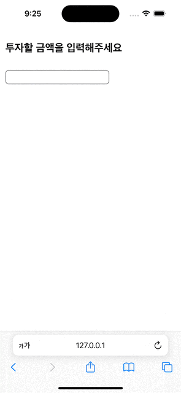

웹 프론트엔드 개발자가 가져야할 역량 중 하나는 사용자에게 좋은 사용자 경험을 제공하는 것입니다. 스스로가 서비스 기능을 사용하는 최초의 사용자가 되어 사용자 경험을 높이는 방법을 고민해야 합니다.

**이 글에서는 사용자 경험을 향상시킬 수 있는 사소한 디테일을 소개합니다.**

## 터치 피로감을 줄이기 위한 올바른 가상 키보드 하기

혹시 웹 사이트를 사용하면서 숫자를 입력하려고 할 때 한글 키보드가 나타나는 경험을 해본 적이 있으신가요?



이럴 때 우리는 한글 키보드에서 숫자 키보드로 전환하기 위해 **불필요한 터치**를 한번 더 해야 합니다.

이런 불필요한 터치가 한번만 있는 것이라면 큰 문제가 되지 않습니다. 하지만 연속적인 여러 입력을 해야하는 경우라면 키보드 전환을 위해 불필요한 터치를 반복적으로 해야합니다.

사용자에게 불필요한 터치가 늘어날 수록 피로감을 느끼게 됩니다.

따라서 상황에 맞는 키보드를 보여주는 것은 사용자 경험을 향상시키는 중요한 요소입니다.

HTML input 태그에는 모바일 가상 키보드를 올바르게 설정할 수 있는 방법이 있습니다.

## inputmode 속성

input 태그의 inputmode 속성을 사용하면 모바일 환경에서 가상 키보드의 종류를 지정할 수 있습니다.

```html
// 숫자 입력이 편한 키보드를 보여줍니다.

<input type="text" inputmode="numeric" />
```

inputmode 속성이 가질 수 있는 값은 총 8가지입니다.

1. none : 키보드를 보여주지 않습니다. 주로 자체적으로 커스텀 키보드를 사용하는 경우에 사용합니다.
2. text : 일반 텍스트를 입력할 수 있는 키보드를 보여줍니다. 기본값입니다.
3. tel : 전화번호를 입력할 수 있는 키보드를 보여줍니다.
4. url : URL을 입력할 수 있는 키보드를 보여줍니다.
5. email : 이메일을 입력할 수 있는 키보드를 보여줍니다.
6. numeric : 숫자를 입력할 수 있는 키보드를 보여줍니다.
7. decimal : 소수점을 입력할 수 있는 키보드를 보여줍니다.
8. search : 검색을 위한 키보드를 보여줍니다.

## 사용 예시와 함께 알아보기

### 1. 검색

inputmode 속성을 "search"로 설정하면 검색을 위한 키보드를 보여줍니다. 기본 키보드와 차이점은 기존의 `엔터` 키가 `검색` 버튼으로 변경된다는 점입니다. ios에서는 return 버튼이 go 버튼으로 변경됩니다. 검색버튼이 강조됨에 따라 사용자가 검색을 하고 있다는 것을 더욱 명확하게 알 수 있습니다.

### 2. 이메일 입력

이메일로 회원가입을 받는 경우 inputmode 속성을 "email"로 설정하면 이메일을 입력할 수 있는 키보드를 보여줍니다. 이메일 형식에 맞는 키보드를 보여주기 때문에 사용자가 이메일을 입력할 때 더욱 편리하게 입력할 수 있습니다.

기존의 한글 키보드가 영어 키보드로 변경되고 `@` 버튼이 추가되어 더욱 편리하게 입력할 수 있습니다.

### 3. 숫자입력

## 요약하면

- 불필요한 터치를 줄여 터치 피로감을 줄이는 것은 사용자 경험을 향상시키는 중요한 요소입니다.
- 따라서 좋은 사용자 경험을 위해 **상황에 맞는 가상 키보드**를 보여주는 것이 중요합니다.
- input 태그의 **inputmode** 속성을 사용하면 모바일 환경에서 가상 키보드의 종류를 지정할 수 있습니다.
