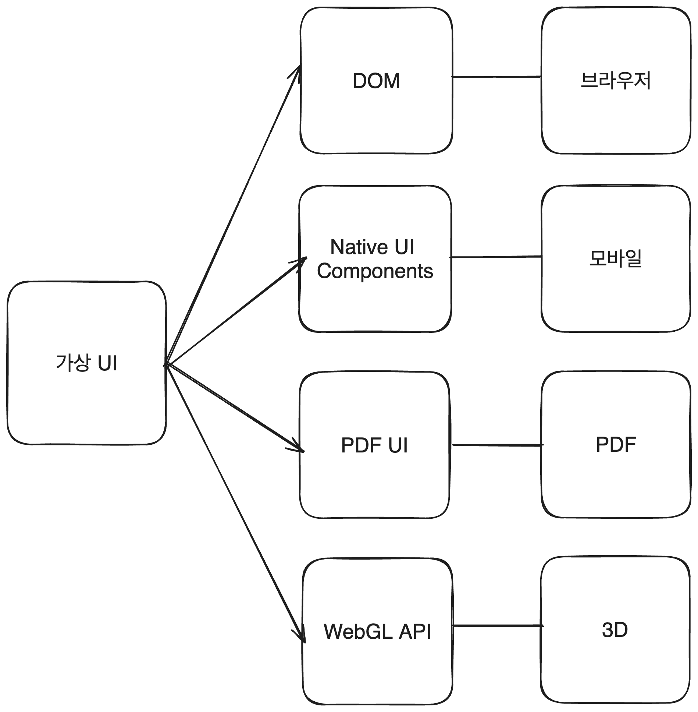
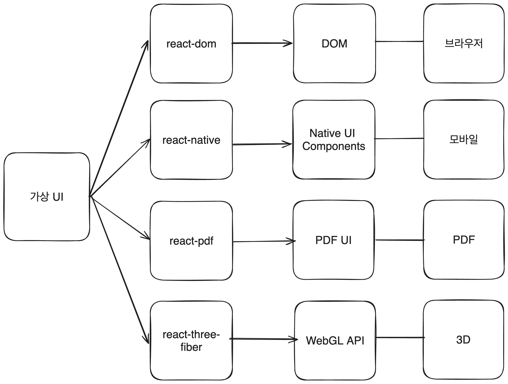

## 가상 DOM에 대한 오해

React로부터 유명해진 가상 DOM은 이제 막 프론트엔드 개발을 시작하는 사람들에게 혼란을 주는 개념입니다. 오해를 가지기 쉬운 이유는 대부분의 블로그 글이나 강의에서 다루는 가상 DOM에 대한 설명이 아래와 같은 **본질보다는 부가적인 것들에 다루고** 있기 때문입니다.

- 가상 DOM은 실제 DOM을 메모리에 가상으로 구현한 것이다.
- 가상 DOM은 diffing 알고리즘과 재조정(Reconciliation) 과정을 통해 변경된 부분만 효율적으로 실제 DOM에 반영한다.
- 가상 DOM을 사용하면 브라우저 렌더링 과정 중 reflow, repaint의 비싼 비용을 줄일 수 있다.

이러한 정보들을 바탕으로 다음 결론을 내리곤 합니다.

- **결론 1: 가상 DOM은 브라우저의 reflow, repaint 비용을 줄여주기 위해 등장한 기술이다.**
- **결론 2: 가상 DOM을 사용하는 이유는 성능 개선을 위해서다.**

완전히 틀린 말은 아닌 것으로 보입니다만 이런 가상 DOM 개념에 대한 접근방법은 핵심을 놓칩니다. 우리는 가상 DOM에 대한 오해를 해소하고 가상 DOM을 사용하는 이유에 대해 다시 생각해 봐야 합니다.

\* 가상 DOM이 React만을 위한 기술은 아니지만 이 글에서는 React를 예시로 들어 설명합니다.

## DOM은 잊어버려

제가 생각하는 일반적인 프론트엔드 개발 학습 순서는 아래와 같습니다.

1. HTML, CSS, JavaScript를 배운다.
2. 브라우저와 DOM에 대해 배운다.
3. React와 가상 DOM에 대해 배운다.

이러한 학습 순서 때문일까요? 우리는 **React에 대해 생각할 때 지나치게 브라우저와 DOM과 연관 지어 생각**합니다. 그리고 가상 DOM에 대해 이해할 때도 DOM에 대한 지식을 바탕으로 이해하려고 합니다.

**아이러니하게 가상 DOM을 이해하기 위해서는 DOM에 대해 잊어버려야 합니다.**

DOM에서 한 걸음 물러서 두 개념을 바라볼수록 가상 DOM에 대한 이해가 더욱 쉬워집니다. 우선 단어부터 바꿔서 부르는 것부터 시작해 봅시다. 이제부터는 가상 DOM이라는 단어 대신 `가상 UI`라는 단어를 사용하겠습니다.

## 가상 UI - 렌더링 관심사 분리의 수단

브라우저나 모바일이나 **어떤 환경에서든 UI(유저 인터페이스)는 비슷한 패턴과 구조를 가집니다.** 시간에 따라 변하는 상태(`State`)를 가지며 유저가 행하는 이벤트(`Event`)에 반응하고, 상태에 따라 화면을 업데이트합니다.(`Reactive`)

비슷한 기능을 하는 코드가 있다면 함수로 추상화하여 재사용하듯이, UI를 다루는 비슷한 패턴과 구조를 한데 모아 추상화된 무언가를 만들면 어떨까요?

**즉, 동일한 코드와 동일한 프로그래밍 방식을 사용하면서도 다양한 환경에서 구동되는 UI를 만들고 싶습니다.** 이런 목적을 달성하기 위해서 우리는 렌더링 관심사를 분리해서 생각할 필요가 있습니다.

동일한 프로그래밍 방식을 위한 레이어를 `가상 UI`라고 부르고, 실제 UI를 렌더링하는 레이어를 `실제 host 환경`이라고 부르겠습니다.

즉, React를 사용하는 UI는 다음과 같이 두 레이어로 나눌 수 있습니다.

1. 가상 UI 레이어
2. 실제 host 환경 레이어



**가상 UI는 실제 host 환경과 렌더링 방식에 대한 관심사를 분리합니다.** 렌더링 관심사를 분리함으로서 우리는 실제 host 환경의 렌더링에 대해 걱정할 필요 없이 동일한 방식과 코드로 가상 UI를 만들 수 있습니다. DOM이 브라우저에서 어떻게 렌더링되는지, 모바일은 어떻게 렌더링되는지에 대해 걱정할 필요 없이 동일한 방식으로 UI를 만들 수 있습니다.

예를 들어, 실제 host 환경이 무엇이든지 상관없이 useState hook을 사용할 수 있습니다. useState는 가상 UI를 다루는 로직이기 때문에 브라우저든, 모바일이든 어떤 환경이든지 상관없이 동일한 방식으로 사용할 수 있습니다.

```jsx
// DOM 환경
import { useState } from 'react';
function Foo() {
  const [count, setCount] = useState(0);

  return <button></button>;
}

// Native Mobile 환경
import { useState } from 'react';
import { Button } from 'react-native';

function Bar() {
  const [count, setCount] = useState(0);
  return <Button></Button>;
}
```

react를 이루는 아래 로직은 모든 환경에서 동일하게 사용할 수 있습니다.

- useState, useEffect, ...hooks
- props, state
- life cycle
- Suspense, ErrorBoundary
- 등등

정리하면 가상 UI는 실제 호스트 환경과 렌더링에 대한 관심사를 분리하고, 다양한 환경에서 동일한 프로그래밍 방식으로 UI를 만들 수 있게 해줍니다.

## Renderer(렌더러)



사실 가상 UI만으로는 실제 host UI를 마법처럼 렌더링할 수는 없습니다. 실제 host UI를 렌더링하기 위해서는 가상 UI를 실제 host 환경에 맞추어 렌더링해주는 것이 필요합니다. `렌더러`가 바로 그 역할을 합니다.

예를 들어, 브라우저에 표시할 UI를 위해서는 `DOM`이 필요합니다. 가상 UI를 DOM으로 렌더링해주는 렌더러가 `ReactDOM`입니다.

```jsx
import { createRoot } from 'react-dom/client';

const root = createRoot(document.getElementById('root'));

// App이라는 가상 UI 트리를 실제 DOM에 렌더링합니다
root.render(<App />);
```

만약 가상 UI로 PDF 파일을 생성하고 싶다면 `react-pdf` 렌더러를 사용할 수 있습니다.

```jsx
import React from 'react';
import ReactPDF from '@react-pdf/renderer';

ReactPDF.render(<MyDocument />, `${__dirname}/example.pdf`);
```

렌더러의 내부를 들여다보면 host 환경에 맞추어 가상 UI를 렌더링하는 방법이 담겨있습니다.

이외에도 정말 다양한 렌더러가 있습니다.

- figma 컴포넌트로 렌더링하는 렌더러 ([react-figma](https://github.com/react-figma/react-figma))
- command-line interface로 렌더링하는 렌더러 ([ink](https://github.com/vadimdemedes/ink/blob/168244470cd3e4b85e19b968a55938d013232761/src/reconciler.ts#L4))
- Slack 메시즈로 렌더링하는 렌더러 ([react-slack-render](https://github.com/andreyvital/react-slack-renderer))
- 등등...

React가 제공하는 API를 사용하면 자신만의 커스텀 렌더러를 만들 수 있습니다.

```jsx
const Reconciler = require('react-reconciler');
const HostConfig = {};
const MyRenderer = Reconciler(HostConfig);
const RendererPublicAPI = {
  render(element, container, callback) {},
  // 다양한 메서드들...
};
```

## 마무리

이때까지의 내용을 정리하면 다음과 같습니다.

- 가상 UI는 실제 host 환경과 렌더링 방식에 대한 관심사를 분리합니다.
- 가상 UI는 동일한 프로그래밍 방식으로 다양한 환경에서 UI를 만들 수 있게 해줍니다.
- 렌더러는 가상 UI를 실제 host 환경에 맞추어 렌더링해줍니다.

가상 UI가 단순히 브라우저와 DOM에 종속적인 개념이 아니라 그 이상의 강력한 도구이자 수단임을 알게되었습니다. 이제 가상 UI에 대한 오해를 해소하고 가상 UI를 사용하는 이유에 대해 다시 생각해 볼 차례입니다.
